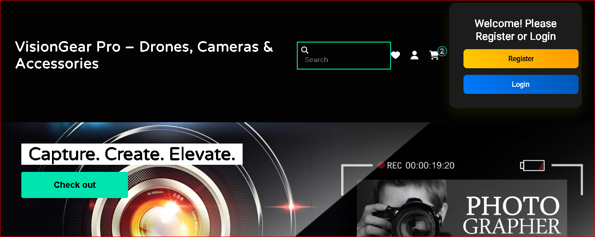

# VisionGear-Pro-OnlineStore-website
A web-based platform for browsing, purchasing products, and managing orders with user authentication and an admin panel. Built with PHP, MySQL, JavaScript, HTML, CSS, and Tailwind CSS.

A web-based e-commerce platform for browsing products, managing orders, and handling user authentication with an admin panel.

## Features
- User registration and login system
- Product listing and search functionality
- Shopping cart and checkout system
- Admin panel for product and order management

## Technologies Used
- **Frontend:** HTML, CSS, JavaScript, Tailwind CSS
- **Backend:** PHP, MySQL

## Usage
- Users can sign up, browse products, add to cart, and place orders.
- Admin can manage products and orders from the admin panel.

# Online Store

